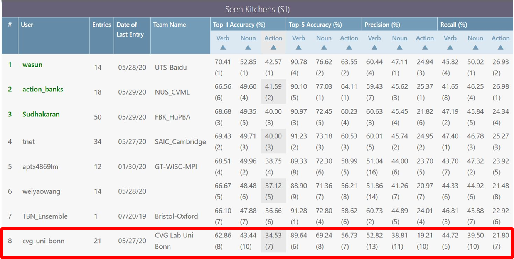
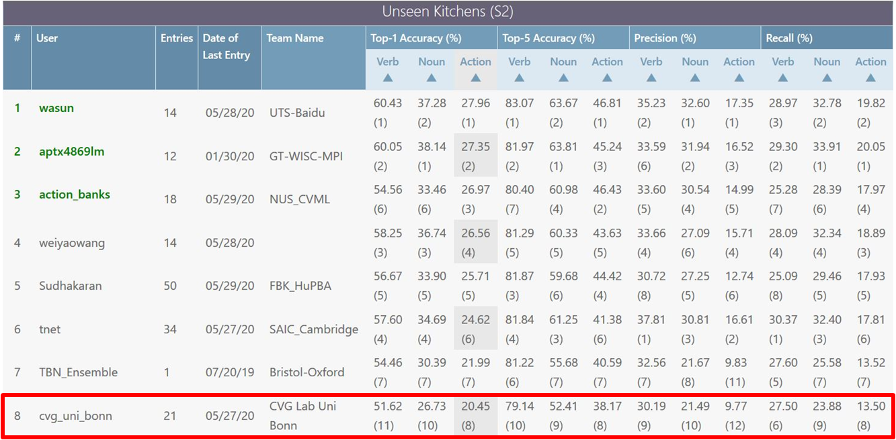

# Attention based Temporal Binding Network

This work is part of my Master Thesis titled "A Study of Audio effectiveness for Action Recognition from egocentric videos". The complete writeup can be found at [thesis/Master_Thesis.pdf](thesis/Master_Thesis.pdf).

## Getting Started
Clone the repo and set it up in your local drive

```
git clone https://github.com/tridivb/attention_based_tbn.git
```

## Prerequisites
1. Ubuntu 16x/18x (The framework has not been tested beyond these two systems.)
2. Cuda 10.2
3. Miniconda/Anaconda
4. Install the required python environment via the instructions in [INSTALL.md](install/INSTALL.md)

## Preprocessing
Setup the dataset in the below structure:

```
├── root
|   ├── video1
|   |   ├── img_0000000000.jpg
|   |   ├── x_0000000000.jpg
|   |   ├── y_0000000000.jpg
|   |   ├── .
|   |   ├── .
|   |   ├── .
|   |   ├── img_0000000100.jpg
|   |   ├── x_0000000100.jpg
|   |   ├── y_0000000100.jpg
|   ├── .
|   ├── .
|   ├── .
|   ├── video10000
|   |   ├── img_0000000000.jpg
|   |   ├── x_0000000000.jpg
|   |   ├── y_0000000000.jpg
|   |   ├── .
|   |   ├── .
|   |   ├── .
|   |   ├── img_0000000250.jpg
|   |   ├── x_0000000250.jpg
|   |   ├── y_0000000250.jpg
|   ├── audio
|   |   ├── video1.wav
|   |   ├── video2.wav
|   |   ├── .
|   |   ├── .
|   |   ├── .
|   |   ├── video10000.wav
|   ├── annotations
|   |   ├── annotation_file1.csv
|   |   ├── annotation_file2.csv
|   |   ├── .
|   |   ├── .
|   |   ├── .

```

Since we primarly work with the [Epic-Kitchens 55](https://github.com/epic-kitchens), scripts are provided in [preprocessing](preprocessing) to automate this step on the Epic-Kitchens-55 dataset. Scripts to create symlinks from the visual frames and extract the audio from videos are included inside the directory. One can also setup their own dataset in the above format to use with the framework.

The dataset splits are done by providing the video names in separate train/validation files in the [data](data) directory. There are two splits for train and validation as "Seen" and "Unseen". The "Seen" set contains 14 videos held out for validation and the "Unseen" set contains all videos with person id "P_25" and above for validation.

You can randomly generate your own "Seen" set with the [create_epic_split.py](preprocessing/create_epic_split.py) script. Move those files to the [data](data) directory once they are generated.

## Pretrained Weights
Download the pretrained weights for imagenet and kinetics as:

```
cd weights
./download.sh
```

Some of the trained models for our baselines and experiments can be found at this [link](https://drive.google.com/drive/folders/19rbjMRqtOdLv_b1WnGTq_BJ2TsMwDFsO?usp=sharing).

## Configuration
The list of configuration parameters can be found at [CONFIG.md](config/CONFIG.md).

## Using the framework
The code to train/test models can be executed by running the [main.py](main.py). It will initialize the configuration parameters and then run the tasks as required. The configurations can be also set from the command line. Please look at the list of configuration parameters and the hydra documentation on how to do this.

The visualization module is provided as a Jupyter Notebook. Since it uses ipywidgets and qgrid, please make sure they are installed and enabled before running the visualization module.

## Training

A single-modality network can be trained as follows:

```
python main.py model.attention.enable=False data.rgb.enable=False data.flow.enable=False data.audio.enable=True data.audio.audio_length=1.279
```

The above command will initialize a model to train only on the Audio.

A multi-modality network (RGB+Flow+Audio) without attention and asynchronous sampling can be trained as:

```
python main.py model.attention.enable=False data.sampling="async" data.rgb.enable=True data.flow.enable=True data.audio.enable=True
```

A multi-modality network (RGB+Audio) with fixed uniform attention and synchronous sampling can be trained as:

```
python main.py model.attention.enable=True model.attention.use_fixed=True model.attention.prior_type="uniform" data.sampling="sync" data.rgb.enable=True data.flow.enable=False data.audio.enable=True 
```

Our multi-modality network (RGB+Audio) with trainable multi-headed attention, synchronous sampling and entropy loss was be trained as:

```
python main.py model.attention.enable=True model.attention.type="mha" model.attention.use_entropy=True model.attention.entropy_decay=0.25 model.attention.decay_step=10 data.sampling="sync" data.rgb.enable=True data.flow.enable=False data.audio.enable=True train.optim.accumulator_step=4
```

The enable flag Optical Flow can simply be set to True for training a RGB+Flow+Audio network with attended audio.

## Testing

The evaluation of models can be done by enabling the test module.

To evaluate the RGB+Audio with Multiheaded attention and entropy loss, run the following command after setting the annotation file names along with full path to pre-trained weights in [config/test/tbn_test.yaml](config/test/tbn_test.yaml):

```
python main.py model.train.enable=False model.attention.enable=True model.attention.type="mha" model.attention.use_entropy=True model.attention.entropy_decay=0.25 data.rgb.enable=True data.flow.enable=False data.audio.enable=True 
```

Take care that the model configuration must match that of the pre-trained weights.

## Results

Detailed explanations on our experiments can be found in the thesis (Chapter 7). Our best performing model uses all modalities with multiheaded attention and entropy loss. A comparison table of top-1 accuracies (in percentage) from the two validation sets are shown below:

Seen scores:

Type | Verb | Noun | Action |
|:----:|:----:|:----:|:------:|
| Baseline | 60.42 | 42.53 | 30.65 |
| MHA+Entropy | 63.01 | 45.33 | 33.03 |


Unseen scores:

Type | Verb | Noun | Action |
|:----:|:----:|:----:|:------:|
| Baseline | 44.27 | 21.85 | 12.61 |
| MHA+Entropy | 48.39 | 26.01 | 15.46 |

## Epic-Kitchens Evaluation

The epic-kitchens test server submission for all modalities with attention scores can be saved by executing the test module as follows:

```
python main.py model.train.enable=False model.attention.enable=True model.attention.type="mha" model.attention.use_entropy=True model.attention.entropy_decay=0.25 data.rgb.enable=True data.flow.enable=True data.audio.enable=True test.save_results=True
```

Our best action score on the test server submissions was achieved by a model trained over all modalities with an additional action class. Please look at the thesis (Section 7.5) for more details on this. Our final scores placed us 8-th in the public leaderboard for Epic-Kitchens Action Recogntion challenge.





## Visualization Module

The visualization module allows us to look at the trained attention weights. To run this, set the required configuration parameters in [config/config_vis.yaml](config/config_vis.yaml) and then run the notebook. 

To filter out actions, set the verb and noun in the given placeholder and execute the code. An interactive table is provided which displays the index of each sample, the entropy of each learned attention, the ground truth and the top-1 predictions. The slider will allow you to select specific samples for which you want to view the trained weights. A sample can be is provided at [results/vis.png](results/vis.png).

## License

This project is licensed under the MIT License - see the [LICENSE](LICENSE) file for details.

Please note, the original EPIC-Fusion framework is licensed under the Creative Commons Attribution-NonCommercial-ShareAlike 4.0 International License. Please respect the original licenses as well.

## Acknowledgments

1. EPIC-Fusion: Audio-Visual Temporal Binding for Egocentric Action Recognition
    ```
    @InProceedings{kazakos2019TBN,
    author    = {Kazakos, Evangelos and Nagrani, Arsha and Zisserman, Andrew and Damen, Dima},
    title     = {EPIC-Fusion: Audio-Visual Temporal Binding for Egocentric Action Recognition},
    booktitle = {IEEE/CVF International Conference on Computer Vision (ICCV)},
    year      = {2019}
    }
    ```

2. Readme Template -> https://gist.github.com/PurpleBooth/109311bb0361f32d87a2
